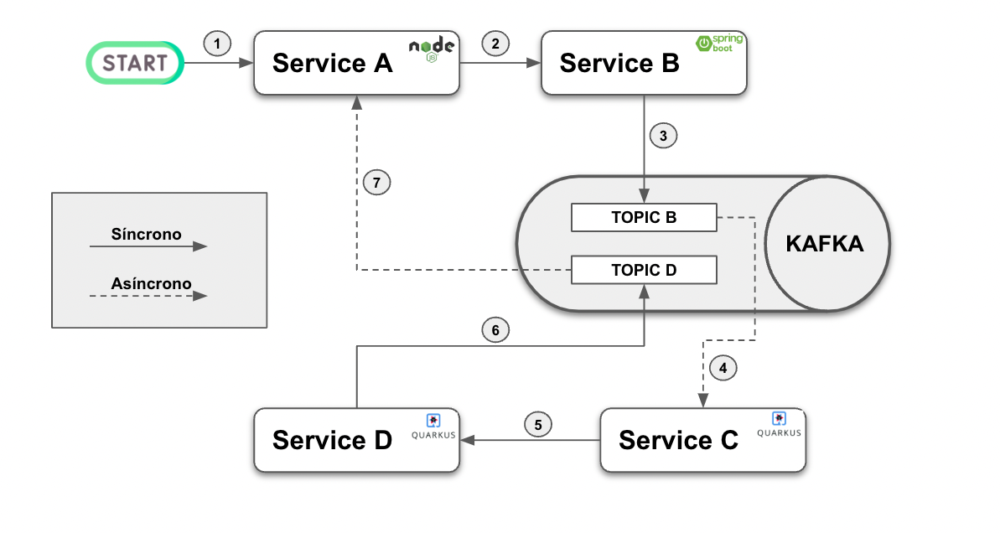
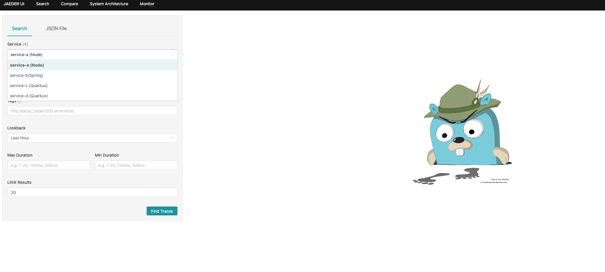
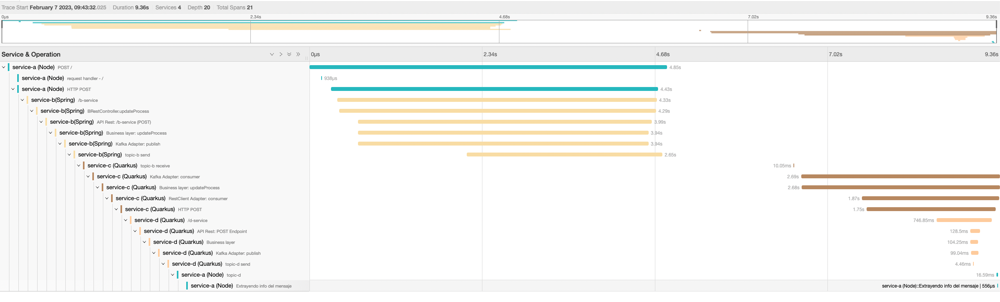
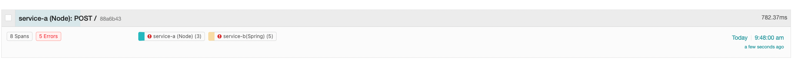
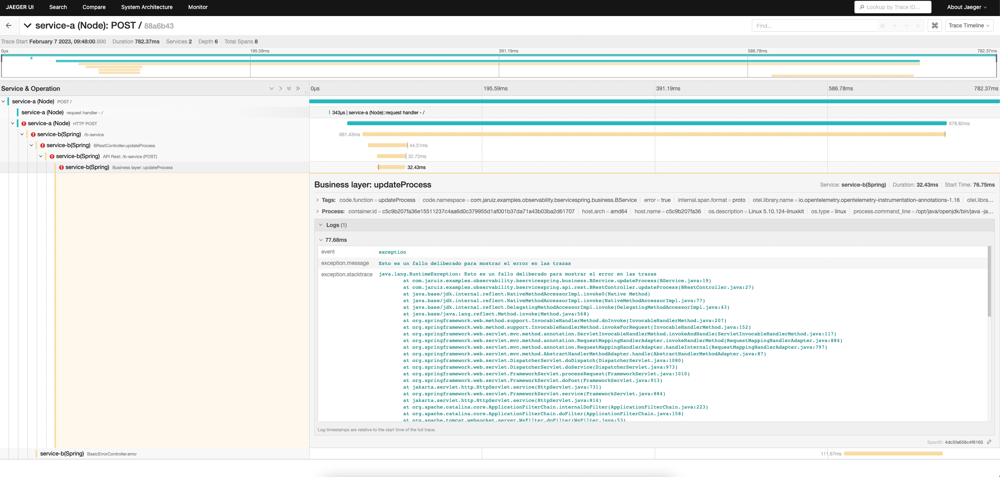

# Trazabilidad distribuida con OpenTelemetry
Este repositorio contiene un proyecto de ejemplo para jugar con OpenTelemetry y la trazabilidad distribuida.


# Caso de uso

El caso de uso es el siguiente:



En la imagen, podemos ver que el servicio A es el punto de entrada al sistema. Expone un API Rest, con una operación POST que recibe un valor inicial. A partir de ese valor inicial, cada servicio suma 10. Por lo tanto, si empezamos con un valor inicial de 10, al finalizar las ejecuciones, en el topic “topic-d” veremos un valor de 40.

Como vemos, hay cuatro servicios, heterogéneos, que interaccionan entre sí. Podemos encontrar un servicio implementado con NodeJS, otro con Spring Boot y otros dos con Quarkus. Además, vemos que existen tanto llamadas síncronas como llamadas asíncronas. Saber lo que está pasando, en este tipo de sistemas, es muy complicado si no se dispone de herramientas como OpenTelemetry.


# Jugando con OpenTelemetry

Para levantar el entorno se debe ejecutar el siguiente comando:

```bash
sh build.sh
docker-compose up -d
```


Ahora lanzamos una petición al primer servicio, indicando que, por ejemplo, se establece un valor inicial de 10 (como hemos visto antes, cada servicio suma 10 a ese valor):

```bash
curl --location --request POST 'http://localhost:8080/' \
--header 'Content-Type: application/json' \
--data-raw '{
    "initialValue": 10
}'
```


A continuación, lanzamos el siguiente comando para escuchar el topic “topic-d” y ver cuando el servicio D ha publicado el último mensaje:

```bash
docker-compose exec kafka bin/kafka-console-consumer.sh --topic topic-d --from-beginning --bootstrap-server localhost:9092
```


El comando deja en espera a la consola y, cuando el mensaje se haya publicado el mensaje y se consuma, veremos algo similar a:

```bash
 {"id":1675688332228,"initValue":10,"currentValue":40}
```


Accedemos ahora a Jaeger para ver, en modo visual, la traza de la operación. Para ello, vamos a http://localhost:16686 . Veremos la pantalla principal, en la que aparecen los 4 servicios:



Buscamos las trazas asociadas al servicio A. Nos aparecerá al menos una. Si hacemos click en ella, accedemos a sus detalles:




## Operaciones con error

Dentro del código he añadido unas líneas en el servicio B para provocar una excepción en el caso de que el valor inicial sea negativo. Por tanto, si lanzamos la siguiente petición inicial:


```bash
curl --location --request POST 'http://localhost:8080/' \
--header 'Content-Type: application/json' \
--data-raw '{
    "initialValue": -10
}'
```


Si volvemos a buscar las trazas en Jaeger, veremos que aparece una nueva que contiene spans de Error:



Si hacemos click en ella, podremos ver incluso el detalle de la excepción:




# Apagando el entorno

Para apagar el entorno, simplemente tendremos que ejecutar:

```bash
docker-compose up -d
```


